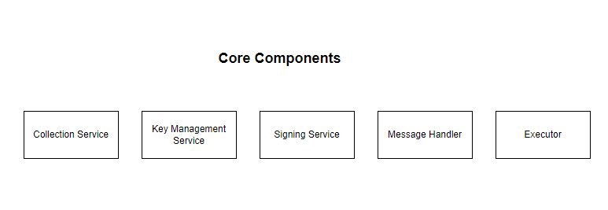
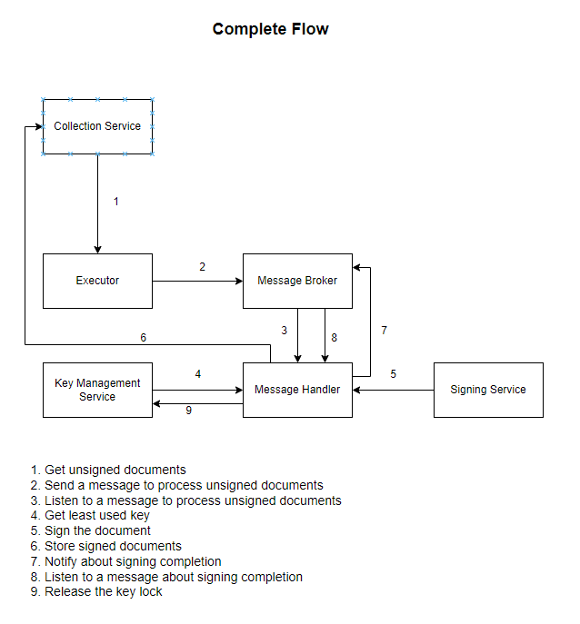
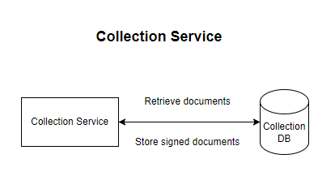
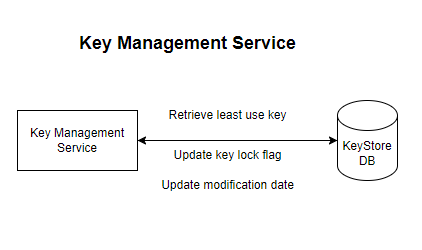
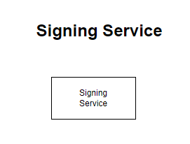
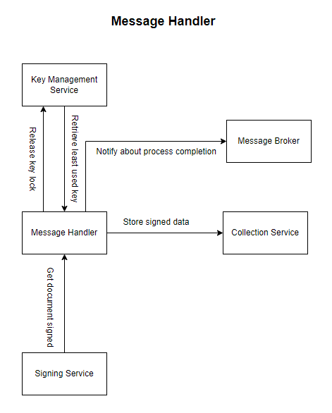
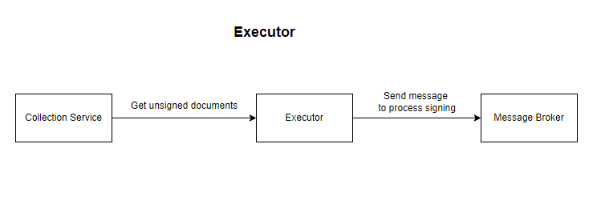

# Concurrent key signing service

**Problem Statement**
Implement a record signing service using a message driven / microservice solution.

Given a database of 100,000 records and a collection of 100 private keys, create a process to concurrently sign batches of records, storing the signatures in the database until all records are signed.

**Rules**

* No double signing: Only a signature per record should be stored (sign each record individually in batches of X size)
* Any given key in the keyring must not be used concurrently
*NOTE: I am assuming we can not use a key before storing the data.*
* A single key should be used for signing all records in a single batch
* Keys should be selected from least recently used to most recently
* Batch size should be configurable by the user (does not change during runtime)

**Guidelines**

* Use a runtime environment of your choosing (we predominantly use Golang and Typescript but language knowledge assessment is not the aim of this challenge)
* Use any orchestration or process coordination tools you see fit (message queues, lambdas, etc)
* Seed the records with any random data
* Use a public key crypto algorithm of your choosing

## How to run the application
Prerequists:
* Docker
**Steps to run**:
* Open terminal from the root folder
* Execute `docker-compose build`
* Execute `docker-compose up`

**Common issues**:
* As we are running the database server in Docker, it sometimes crashes. In that cases, we need to rerun database server.
* Due to the random time it takes to create the database server and database (sometimes less than 30 seconds, sometimes more than a minute), we have added delays to the data seeding tool and executor service.

## Tech stack
* .NET 6
* SQL Server
* Azure Service Bus
* Docker

## Third party libraries
* **Dapper**: For sql query execution.
* **NSwag**: Swagger and http client from swagger.
* **xunit**: Unit and integration tests

## Core Services

### Collection Service
We will retrieve a collection of data from the database, and utilize this service to store the signed data.

### Key Management Service
The primary function of the service is to manage public and private keys. When requesting a key, it locks the table, sets the locked flag to true, and returns the least used item from. The Key Management Service returns encrypted, base64-encoded data. When calling the release lock endpoint, it updates the locked flag to false and update the modified timestamp.

### Signing Service
The responsibility of this service is to handle the signing of the data using the private key.
Probably we can move the service as serverless function later on.

### Message Processor
It will listen to trigger messages and perform specific actions based on their content. The initial plan is to handle two types of messages:
* SigningTriggered
* SingingCompleted

**SigningTriggered**
This message contains X amount of document data and a public key. The processor, call the signing service to sign the data and collection service to store the signed data.
When the signing is finished, it will trigger another message `SingingCompleted`

**SigningCompleted**
`SigningCompleted` message contains the public key information, and it can also include a summary message about the signing process (which may be useful for monitoring services in the future). 
The processor retrieves the key information from the message and calls the key management service to unlock the key.

### Signing Executor
It will work as aggregator, the responsibilities are:
* Get batch data from collection service.
* Trigger a message with batch data.

### Other tools
**Data Seeder**
Seed data to the databases.

## High Level Design

## Possible Improvements
* Error handling
* Better http error response
* Proper logging
* Consider pre populate the keys in a cache.
* Better naming
* More unit and integration tests
* Using GRPc for service to service communication

## Possible Questions
**How the solution is secured?**:
* In the solution the most confidencial data is the private key. By encrypting it in the key management service and decrypting it in the signing service using a shared key, we mitigate security risks.
* Additionally, for production deployment, we plan to run the key management service and/or signing service in a private network to further enhance security.

**How we can confirm the data is signed for a single time?**
* When storing the data, we first check if it already exists in the database to prevent duplicate signing.
* Additionally, since we utilize Azure Service Bus queue, each message is processed by a single listener, further ensuring that data is signed only once."

**How we can make sure one key can not be used concurrently?**
* When we get the private key, inside a transaction we do lock the key.

**How we can make sure the least used key is being used for signing?**
* When the migration is completed, we trigger another message and the listener remove the lock flag and update the modification date.
* During key retrieval, we order the keys by modification date in ascending order, ensuring that the least recently used key is prioritized for signing."

**What happen with the key lock when data storing get failed?**
* If there is something wrong after locking the key, it release the lock.

**Why we are not using separate message for storing data?**
* It might be a better approch, but as the requirement of not using a key concurrently is not clear enough, we have decided to release the lock after storing the data.

**What happen, when all the keys are in locked state?**
* When Key Management Service unable to find a key, it returns 404 status code, and Message Handler Service, reschedule the event.

**Is there any single point of failure?**
* Collection Service: As this service is used to retrieve and save data, it could be a single point of failure.
* Key Management Service: If the service is unavailable, we reschedule the event. So this is not consider as single point of failure.
* Signing Service: When the service is unavailable, message processor retry the operations, as a result minimal downtime is acceptable.
* Message Handler Service: When the service is available, it will retry pending messages, so this is not a single point of failure.